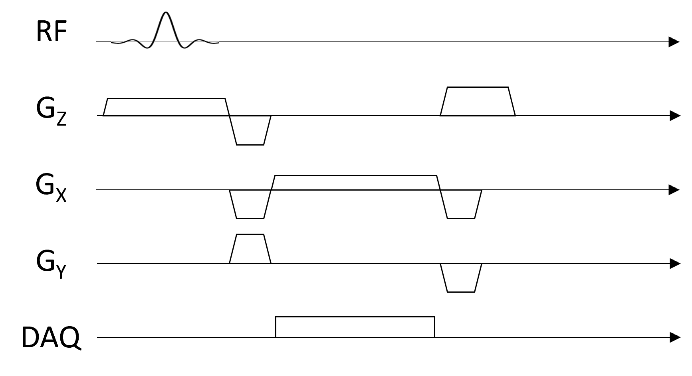
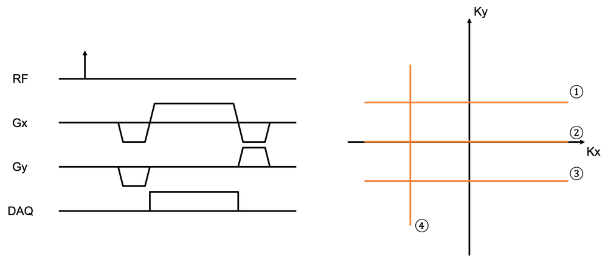

# MRI Questions

Note that questions may have multiple possible answers.

## MRI System

Clinical MRI systems (i.e. 3T and 1.5T) operate in the same frequency range as ..
* Xray
* Visible light
* FM
* AM

The main magnetic field, $B_0$, is for ...
* polarization
* excitation
* acquisition

Which coil(s) generates a magnetic field(s) that are perpendicular to the main field $B_0$?
* RF coils
* gradient coils in the x direction
* gradient coils in the y direction
* gradient coils in the z direction

(T/F) In MRI, the imaging plane is determined by proper assignment on the x, y, and z gradients

Match the following components with the approximate amplitude of their magnetic field
* Components: $B_0$, RF transmit coil, RF receive coil, magnetic field gradients
* frequency of magnetic field: 0 Hz, 1 kHz, 100 MHz
* amplitude of magnetic field: 1 $\mu T$ , 10 $\mu T$, 10 $m T$, 1 $ T$

Which of the following steps are conducted in a calibration scan?
* Center frequency / B0 calibration
* RF power, transmit gain
* RF receiver gain
* Gradient calibration

<!-- 
Which of the following parameter(s) change with the main magnetic field strength?
* Resonance frequency
* Magnetic field gradients
* Equilibrium magnetization, $M_0$
* Amount of displacement due to fat/water chemical shift
* Magnetic field distortions due to magnetic susceptibility differences
* Intensity of motion artifacts
-->

## MR Physics

Which of the following isotopes cannot
be imaged with MRI?
* $^1H$
* $^{12}C$
* $^{13}C$
* $^{19}F$
* $^2H$

Human tissue is ...
* diamagnetic
* paramagnetic
* ferromagnetic

(T/F) When placed in a magnetic field, all the protons ($^1 H$) in the body will line up with the field.

(T/F) When placed in a magnetic field, spins immediately are preferentially aligned with that field.

(T/F) A spin's precession frequency (Larmor frequency) is proportional to the magnetic field it's in.

(T/F) The net magnetization, $\vec{M}$, does not precess at equilibirum.

To create signals in MRI, we need to apply an RF pulse that is ...
* perpendicular to the main field $B_{0}$, oscillating at frequency $0$ Hz (static)
* parallel to the main field $B_{0}$, oscillating at frequency $0$ Hz (static)
* parallel to the main field $B_{0}$, oscillating at a frequency $\gamma B_0$
* perpendicular to the main field $B_{0}$, oscillating at  a frequency $\gamma B_0$

(T/F) The z-axis is the same in lab and rotating frame.

## RF Coils

(T/F) The RF receive coils detect magnetic flux directly when collecting signals.

What are the benefit(s) of using phased array receive coils?
* Increase FOV
* Increase SNR
* Enables parallel imaging acceleration
* Enables compressed sensing acceleration

## Contrast

(T/F) Proton density represents the density of all the protons in a given tissue.

The recovery of longitudinal magnetization is proportional to ...
* $e^{t/T_1}$
* $1- e^{t/T_1}$
* $e^{t/T_2}$
* $1-e^{t/T_2}$

The decay of the transverse magnetization is proportional to ...
* $e^{t/T_1}$
* $1- e^{t/T_1}$
* $e^{t/T_2}$
* $1-e^{t/T_2}$

(T/F) The amplitude of the net magnetization doesn't change during relaxation.

Which of the following equations is correct?
* $T_2 \ge T_2^* \ge T_1$
* $T_2^* \ge T_2 \ge T_1$
* $T_1 \ge T_2 \ge T_2^*$
* $T_1 \ge T_2^* \ge T_2$

T2* relaxation depends on ...
* magnetic field inhomogeneities
* spin-spin interactions
* spin-lattice interactions
* longitudinal relaxation

(T/F) $M_Z$ doesn't contribute to the MR signal.

Calculate the signal in a spin-echo sequence with a 90-degree flip angle $M_0(1-e^{-TR/T1})e^{-TE/T2}$ when TR = ∞
* $M_0$
* $0$
* $M_0(1-e^{-TR/T1})$
* $M_0 e^{-TE/T2}$

Calculate the signal in a spin-echo sequence with a 90-degree flip angle $M_0(1-e^{-TR/T1})e^{-TE/T2}$ when TE = ∞
* $M_0$
* $0$
* $M_0(1-e^{-TR/T1})$
* $M_0 e^{-TE/T2}$

A longer TR ...
* increases T1 weighting
* reduces T1 weighting
* increases T2 weighting
* reduces T2 weighting

A longer TE ...
* increases T1 weighting
* reduces T1 weighting
* increases T2 weighting
* reduces T2 weighting

1. What flip angle gives the highest SNR for a spoiled gradient echo pulse sequence?
   - 45-degrees
   - 90-degrees
   - 180-degrees
   - $\cos^{-1} ( \exp(-TR/T_1) )$

The signal of an inversion recovery pulse sequence in the steady-state is proportional to ...
* $M_{0}\cdot(1-2e^{-TI/T1})$
* $M_{0}\cdot(1-e^{-TR/T1})$
* $M_{0}\cdot(1-e^{-TI/T1}+e^{-TR/T1})$
* $M_{0}\cdot(1-2e^{-TI/T1}+e^{-TR/T1})$

(T/F) In a spin-echo sequence, the dephasing of spins in the transverse plane is only eliminated at the spin-echo.

Which of the following image contrasts can be generated by a spin-echo pulse sequence?
* PDw
* T1w
* T2w
* T2*w

1. What magnetic resonance property is used to perform fat/water (Dixon) imaging?
   - Proton density
   - T1
   - T2
   - T2*
   - Chemical Shift

1. What are the minimum measurements required to create separate fat and water images?
   - In-phase TE
   - Out-of-phase TE
   - In-phase TE & Out-of-phase TE

1. What is "magnetization preparation" used for?
   - polarization
   - data acquisition
   - create additoinal contrast
   - tissue suppression

1. (T/F) Multiple readouts can be used following a magnetization preparation pulse to improve efficiency

## Pulse Sequence

Which of the following are typically components of a pulse sequence diagram?
* RF Pulses
* Main field ($B_0$)
* Magnetic field gradients ($G_X, G_Y, G_Z$)
* Data acquisition (DAQ)

In a typical pulse sequence, identify the gradients that serve the following functions:
1. spoil transverse magnetization
1. refocus Mxy phase across the slice
1. move to the edge of k-space

Which of the following statement is true for the slice select refocusing gradient?
* The slice select refocusing gradient must have the same gradient amplitude with the slice selective excitation pulse.
* The slice select refocusing gradient must have the same gradient area with the slice selective excitation pulse.
* The slice select refocusing gradient can overlap with the prewinder of the frequency encoding gradient.
* The slice select refocusing gradient can overlap with the gradient echo.

(T/F) For 2D FT imaging, gradient spoiling is usually applied in the slice select direction because the voxel size is larger thus more dephasing can happen within a voxel in that direction.

(T/F) For a GRE or SE with no phase encoding gradient, the k-space position at TE equals 0 (i.e, $\vec{k}(TE) = 0$).

## RF Pulses

What is the flip angle 
θ (in radians) of a constant amplitude (hard) RF pulse with an amplitude 
$B_{1,0}$ and duration $\tau$?
* $\theta = \gamma B_{10} \tau$
* $\theta = \gamma B_{0} \tau$
* $\theta = B_{10} \tau$
* $\theta = \gamma \tau$

(T/F) When describing the RF excitation, we usually neglect the relaxation terms in the Bloch equations because the RF pulse duration is usually much shorter than the relaxation time constants.

(T/F) A constant amplitude 180° pulse that is the same duration as a constant amplitude 90° pulse requires twice the power.

In slice-selective excitation, thinner slices can be achieved by
* decreasing the RF pulse bandwidth, $BW_{RF}$
* decreasing the receive BW
* decreasing the slice-select gradient strength
* increasing the slice-select gradient strength

## Spatial Encoding

(T/F) During frequency encoding, the MRI signal is in the time domain, corresponding to the spatial frequency domain. The Fourier Transform of the signal is in the frequency domain, which corresponds to the image domain.

When is slice selective gradient turned on?
* during the RF excitaiton pulse
* between the RF excitation and the readout
* during the echo (readout)

When is the frequency encoding gradient turned on?
* during the RF excitaiton pulse
* between the RF excitation and the readout
* during the echo (readout)

When is phase encoding gradient turned on?
* during the RF excitaiton pulse
* between the RF excitation and the readout
* during the echo (readout)

When is DAQ turned on during a 2D FT sequence?
* When the slice selective gradient is on
* When the RF is on
* When the phase encoding gradient is on
* When the frequency encoding gradient is on

According to the Nyquist theorem, to avoid aliasing:
* The sampling frequency must be at least half the highest frequency in the signal
* The sampling frequency must be at least twice the lowest frequency in the signal
* The sampling frequency must be at least twice the highest frequency in the signal
* The sampling frequency must be at least half the lowest frequency in the signal

(T/F) Aliasing occurs because of oversampling.

(T/F) During 2D multislice imaging, acquisition for one slice must be completed before the acquisition for the next slice can start.

Which k-space line is acquired by the following magnetic field gradients?

In 3DFT imaging, the gradient added to the slice encoding axis (compared to a 2DFT) is a ...
* frequency encoding gradient
* phase encoding gradient
* either frequency or phase encoding gradient

## Image Reconstruction

For a real-valued image $m(x,y)$, which of the following equation holds for its k-space data $M(k_x,k_y)$?
* $M(k_x,k_y) = M(-k_x,-k_y)$
* $M(k_x,k_y) = -M(-k_x,-k_y)$
* $\mathcal{Real}\{M(k_x,k_y)\} = \mathcal{Real}\{ M(-k_x,-k_y) \}$
* $\mathcal{Imag}\{M(k_x,k_y) \} = \mathcal{Imag}\{M(-k_x,-k_y) \}$

(T/F) In MRI we only look at the magnitude images.

(T/F) The center of k-space always contains the maximum signal.

## Image Characteristics (FOV and Resolution)

The field of view is inversely proportional to...
* receiver BW (RBW)
* readout gradient strength (Gxr)
* TR
* TE

The field of view is directly proportional to...
* receiver BW (RBW)
* readout gradient strength (Gxr)
* TR
* TE

(T/F) An anti-aliasing filter can be applied in the phase encoding direction.

The resolution in frequency encoding direction ( $\delta_x$ ) is equal to ...
* $ \frac{1}{W_{kx}} $
* $ \frac{1}{\frac{\gamma}{2\pi} G_{xr} t_{read}} $
* $ \frac{FOV_x}{N_{FE}} $
* None of the above

## SNR

SNR can be increased by ...
* decreasing voxel size
* increasing total time
* increasing NEX

## Artifacts

Chemical shift displacement artifact is characterized by ...
* signal stretch and pile-up
* bright and dark bands
* Gibbs ringing
* ghosting

Susceptibility displacement artifact is characterized by ...
* signal stretch and pile-up
* bright and dark bands
* Gibbs ringing
* ghosting

Truncation artifacts can be reduced by ...
* improving resolution
* filtering in k-space
* increasing FOV
* increasing NEX

(T/F) Motion artifacts occur only along the phase-encoding direction.

## Fast Imaging Pulse Sequences

What does it mean to use a multiple spin echo pulse sequence?
- multiple spin echoes are created following a single excitation pulse
- multiple k-space lines acquired sequentially
- multiple gradient-echo repetitions after a magnetization preparation pulse
- fully refocused gradients and no spoiling in every TR

What types of contrast can be created with a multiple spin echo pulse sequence?
* proton density weighted
* T1 weighted
* T2 weighted
* T2* weighted

What are the limitations of multiple spin echo pulse sequences?
- Chemical shift and susceptibility displacement artifacts
- T2 blurring artifacts
- ghosting
- SAR

What does it mean to use echo planar imaging (EPI)?
- multiple spin echoes are created following a single excitation pulse
- multiple k-space lines acquired sequentially
- multiple gradient-echo repetitions after a magnetization preparation pulse
- fully refocused gradients and no spoiling in every TR

What are the advantages of EPI?
- Create additional T1, T2, and/or T2* contrast
- Rapidly acquire k-space
- Robust to motion
- Repeated refocusing of intravoxel dephasing

What are the artifacts associated with EPI?
- Chemical shift displacement
- Distortion due to magnetic susceptibility differences
- T2* blurring
- ghosting

What does it mean to use balanced steady-state free-precession (bSSFP)?
- multiple spin echoes are created following a single excitation pulse
- multiple k-space lines acquired sequentially
- multiple gradient-echo repetitions after a magnetization preparation pulse
- fully refocused gradients and no spoiling in every TR

## Accelerated Imaging Methods

Match the acceleration methods
* Partial Fourier
* Parallel Imaging
* Compressed Sensing
* Deep Learning

with the following concept they rely on:
- conjugate symmetry in k-space
- spatial encoding from receive coil arrays
- a sparse representation of the image
- training on prior images to learn expected patterns

(T/R) Partial Fourier, parallel imaging, and compressed sensing or deep learning reconstructions can be used simultaneously.

How is coil sensitivity information gathered for parallel imaging?
- It is stored in a database on the scanner
- A separate scan to measure coil sensitivity maps
- Using fully-sampled data from the center of k-space
- Using fully-sampled data from outer k-space

What is the "g-factor" in parallel imaging?
- How much faster scan can be performed
- Describes noise amplification
- Describes SNR loss
- Describes magnetic field gradients

Compared to the SNR a fully sampled acquistion ($SNR_{full}$), the SNR Of a parallel imaging acquisition ($SNR_{PI}$) with an acceleration factor, $R$, and $g$-factor is
- $SNR_{PI} = SNR_{full}$
- $SNR_{PI} = SNR_{full} / \sqrt{R}$
- $SNR_{PI} = SNR_{full} / g(\vec{r}) $
- $SNR_{PI} = SNR_{full} / (g(\vec{r}) \sqrt{R})$

(T/F) Parallel imaging undersampling can be performed in any direction, regardless of the RF coil configuration. 

Simultaneous multi-slice parallel imaging
- enables acceleration in the slice direction
- requires no modifications to the pulse sequence
- requires RF pulses that excite multiple slices
- requires coil sensitivity information

What type of k-space sampling is required for compressed sensing?
- full sampling
- equally spaced undersampling
- equally spaced undersampling with fully-sampled center of k-space
- pseudo-random undersampling

At least how many training datasets are typically required to develop deep learning MRI reconstruction methods?
- 1
- 10-100
- 1000-10,000
- 100,000-1,000,000

Generalization problems can arise in deep learning MRI reconstruction methods when applied to situations that area different from the training data in which of the following ways:
- different anatomy
- different contrasts
- different sampling patterns
- different B0

Which type of architecture is commonly used for physics-based deep learning MRI reconstruction networks?
- Encoder-decoder
- Unet
- Unrolled
- Recurrant