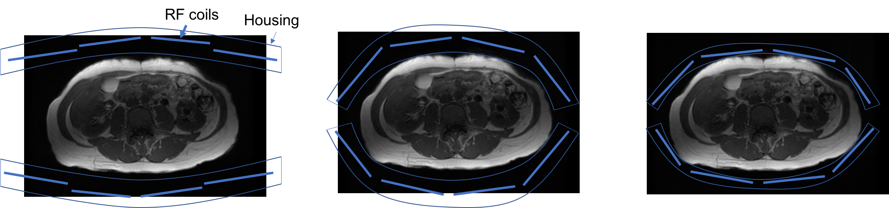

# Magnetic Fields and RF Coils Questions

1. Magnetic fields

    1. Derive the resonance frequency [Hz] of protons in a 64 mT magnetic field (smallest in a clinical MRI) and 7 T (largest in clinical MRI).

    2. The main magnetic field is designed to have a variation of less than 1 relative parts per million (ppm) change in magnetic field across the imaging region. If \( B_0 = 1.5 \) T, what amount of magnetic field variation [T] does 1 ppm correspond to?

    3. The magnetic field is distorted on a tissue-level due to magnetic susceptibility difference between materials, most commonly between tissue and air. Suppose the field is distorted by 3 ppm, what is the resulting change in frequency [Hz] due to this "susceptibility" effect at 1.5 Tesla?

    4. There is a "chemical shift" between protons in water and lipids that means they experience a slightly different magnetic field and thus a slightly different resonance frequency. If the measured resonance frequency difference is -220 Hz when using a 1.5 T MRI scanner, what is this chemical shift difference in [ppm]?

    5. You place a sphere with a diameter of 36 cm in the MRI scanner, turn on a magnetic field gradient with an amplitude of 50 mT/m, what is the resulting range of frequencies present?

1. Coil profile simulation

    Loops of wire, referred to as coils, are powerful in MRI. They are used to create magnetic fields required for MRI as well as receive signal in MRI.

    The magnetic field created by a coil can be simulated, for example using Biot-Savart's law. The function `loop_coil_field.m` in this [MRI-education-resources GitHub repository](https://github.com/LarsonLab/MRI-education-resources) uses this law to calculate the magnetic field from a theoretical circular loop coil with an electric current running through it.

    Examples of using this function are shown in this book.

    1. Run this function, which will generate plots that show the contours of the magnetic field, $[ B_X(\vec{r}), B_Y(\vec{r}), B_Z(\vec{r}) ]$ from a 2D slice through the center of the coil. From the outputs, determine the direction and amplitude of the magnetic field at the center of the RF coil.

    2. Change the coil current amplitude only, plot the magnetic field, and describe the change.

    3. Change the coil radius only, plot the magnetic field, and describe the change.

    4. Change the coil current to be negative, plot the magnetic field, and describe the change.

    5. A gradient coil can simply be created from two loops of wire with a gap between them, but with different direction of current in the two loops. Use this function to simulate a gradient coil simulating two separate loops, one with a positive current and one with a negative current (same amplitude). Magnetic fields follow superposition, meaning you can add the magnetic fields from the two simulations of the separate loops. However, you must consider the coordinates of the magnetic field and manipulate the magnetic field matrices in order to add some separation between the two loops. Plot your result, and describe where you can see the desired magnetic field gradient effect.

    6. For simulating a transmit coil, the current variable represents the current going into the RF coil. For simulating a receive coil, what does the current variable represent?

1. RF coils 
    Suppose you can choose to acquire images with one of the following RF coil configurations.  Which setup would you choose and why?

    

